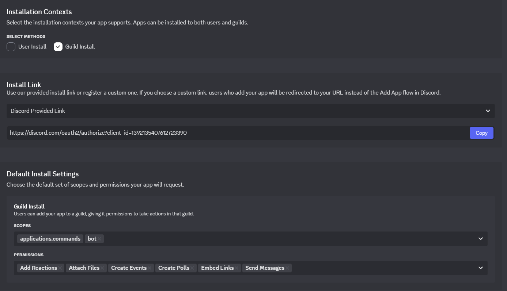

# Discord Bot for Economy, Gambling, and Games

### User Commands:
- **`/help`**  
  displays all commands
- **`/balance`**  
  checks your current coin balance
- **`/dailycoins`**  
  claims your daily reward of coins
- **`/gift`**  
  sends coins to another user
- **`/coinflip`**  
  gamble your coins in a coin flip game
- **`/rockpaperscissors`**  
  play rock-paper-scissors with another member for your betted coins
- **`/leaderboard`**  
  view the richest users on the server
- **`/guessword`**  
  start a new Guess-The-Word game
- **`/guess`**  
  submit a guess for the current word challenge

#### The command arguments get shown in Discord.

----

### Installation:
1. Use the link:  
   https://discord.com/oauth2/authorize?client_id=YOUR_CLIENT_ID_HERE&scope=bot+applications.commands&permissions=274877975552  
   to add the bot to your server.
2. Run `/help` to see all commands and start interacting.

----

### Host the bot yourself:
1. Clone the GitHub repo:  
   https://github.com/YOUR-USERNAME/economy-games-bot.git
2. Create a new bot in the [Discord Developer Portal](https://discord.com/developers/)
   1. In the installation tab match these settings:  
        
      Use the provided link to install the bot (**NOTE: the bot only works if you add the bot to servers while it’s running**)
3. Create a `.env` file at the root of the project and fill in:  
   `DISCORD_TOKEN=your-bot-token` (found in the Bot tab in the Discord Developer Portal)  
   `DISCORD_CLIENT_ID=your-bot-client-id` (found in the General Information tab)
4. Launch the application with `npm run dev` for development, or build and start it for production:  
   `npm run build`  
   `npm run start`